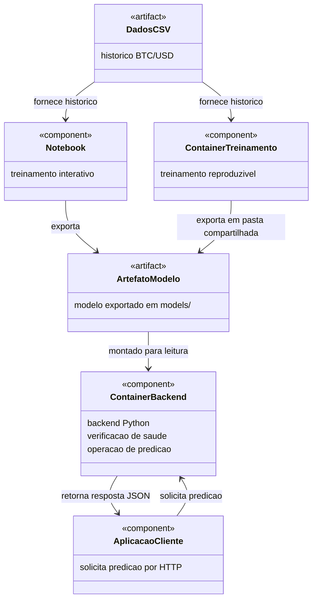
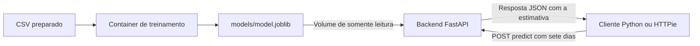

# Devlog Atividade ponderada: modelo de predição com Docker
## Aluno: Maria Arielly Lima de Oliveira
Antes de iniciar o desenvolvimento com auxílio de IA, dividi a atividade nas etapas abaixo para acompanhar a execução e registrar as decisões ao longo do processo. Meu objetivo foi construir uma solução que treinasse um modelo com dados históricos de uma moeda e disponibilizasse esse modelo em um backend Python, executado em outro container.

Ao ler o escopo da atividade, considerei que precisava demonstrar todo o caminho entre os dados, o treinamento, o artefato exportado e uma solicitação de predição. Por isso, organizei o trabalho para validar cada parte antes de avançar. Os registros feitos durante o desenvolvimento estão detalhados de forma mais técnica e aprofundada no [devlog cronológico](docs/devlog.md); neste documento, detalho o que foi feito, como o resultado foi conferido e por que tomei cada decisão.

Passo a passo de execução:

1. Diagrama UML
2. Importação dos dados
3. Treinamento do modelo no notebook
4. Conteinerizar o treinamento em Docker
5. Conteinerizar o backend para carregar o modelo e oferecer predições à aplicação
6. Testar a inferência da predição
7. Fechar documentação + justificativa do uso de IA

# 1. Documentação de cada etapa:

## 1.1. Diagrama UML

Para representar o projeto, utilizei o esboço UML abaixo. Nele, separei o ambiente de treinamento do backend de inferência e deixei explícito o artefato que conecta essas duas partes. Essa separação corresponde ao que o escopo pede: treinar e exportar o modelo, depois carregá-lo em outro container para responder às solicitações da aplicação cliente.

Incluí tanto o notebook quanto o container de treinamento porque, no meu passo a passo, eu queria primeiro observar o treinamento e seus resultados no notebook e depois reproduzir essa execução em Docker. O cliente aparece no diagrama porque o trabalho também precisava demonstrar uma solicitação chegando ao backend e recebendo uma predição.

## Esboço UML da arquitetura

A arquitetura utiliza a pasta `models/` para disponibilizar o artefato ao backend. O container de treinamento pode escrever nessa pasta; o backend recebe o mesmo diretório apenas para leitura.



Mantive essa organização para que a API carregasse um modelo já treinado, sem precisar treinar novamente a cada solicitação. O arquivo `models/model.joblib` funciona como a ligação entre treinamento e inferência: ele é produzido por uma etapa e reutilizado pela outra. Assim, consegui verificar separadamente se o treinamento exportava o modelo e se o backend conseguia carregá-lo.

A transferência do artefato acontece por um volume definido no [Compose](compose.yaml). A pasta local `models/` é montada em `/app/models` dentro dos containers. Quando o treinamento grava o arquivo nesse caminho, ele fica disponível na máquina e pode ser lido pelo backend. Essa escolha também permite que o arquivo continue existindo depois que o container de treinamento termina.

O notebook e o container de treinamento utilizam a mesma função do arquivo [src/train.py](src/train.py). Durante o processo, questionei como essa conexão acontecia e confirmei que o Docker executa o módulo Python diretamente. O notebook chama a função `train()`, enquanto o container executa `python -m src.train`. Reutilizar esse código mantém a preparação das entradas, a avaliação e a exportação iguais nos dois ambientes.

## 1.2. Importação dos dados

Para a base de dados, selecionei o [CryptoDataDownload, histórico da Bitstamp](https://www.cryptodatadownload.com/data/bitstamp/), para o par **BTC/USD**, ou seja, Bitcoin cotado em dólar. A fonte está entre as opções indicadas no escopo e disponibiliza histórico em CSV, com abertura, máxima, mínima, fechamento e volume. Escolhi trabalhar com o arquivo local para que o treinamento pudesse ser repetido sem depender de uma nova consulta à internet.

Inicialmente, foi proposta a utilização de dados de 2023 a 2025. Pedi que o conjunto também incluísse dados de 2026, porque queria trabalhar com um histórico mais recente. A importação resultou em **1.372 registros diários entre 01/01/2023 e 04/10/2026**, dos quais **276 pertencem a 2026**. O registro de 05/10/2026 foi excluído porque o fechamento do dia corrente ainda poderia estar incompleto.

Com auxílio do Codex, foi preparada a rotina de importação em [scripts/import_data.ps1](scripts/import_data.ps1). O arquivo original foi preservado em `data/raw/bitstamp_btcusd_daily.csv`, e a versão preparada foi salva em `data/processed/btcusd_daily.csv`. Manter os dois arquivos permite conferir o que veio da fonte e o que foi selecionado para o treinamento.

Na preparação, a primeira linha do arquivo, que contém um crédito ao fornecedor, foi separada do cabeçalho CSV. As datas foram obtidas a partir do timestamp e interpretadas em UTC. Depois, os registros foram filtrados pelo período definido e colocados em ordem da data mais antiga para a mais recente. O CSV preparado contém `date`, `close` e `volume_btc`; nesta versão do modelo, utilizei somente o fechamento como entrada.

A investigação inicial verificou a cobertura das datas, duplicidades, valores de fechamento e volume e a continuidade dos dias. Foi identificada a ausência de **22/05/2026**. A decisão foi preservar essa lacuna, sem preencher um preço artificial, e excluir do treinamento as sequências que atravessassem o dia ausente. Isso era necessário porque o objetivo era prever o dia seguinte: duas linhas próximas no arquivo não representam necessariamente dois dias consecutivos.

Registrei a origem, o período, a quantidade de registros e os hashes dos arquivos em [data/metadata.json](data/metadata.json). Os hashes permitem conferir se estou utilizando o mesmo conjunto de dados que gerou o resultado documentado. Para repetir a preparação com o CSV já salvo, o comando, na raiz do projeto, é:

```powershell
./scripts/import_data.ps1 -StartDate 2023-01-01 -AsOfDate 2026-10-05 -UseLocal
```

O parâmetro `-UseLocal` reutiliza o arquivo original do repositório. Sem esse parâmetro, o script baixa novamente o histórico, que pode ter sido atualizado pelo fornecedor.

## 1.3. Treinamento do modelo no notebook

Depois da importação, utilizei o Codex para apoiar a investigação da estrutura e da qualidade dos dados. A escolha do modelo foi **Random Forest**, porque tenho mais familiaridade com esse tipo de modelo, seu treinamento e possíveis ajustes. Também considerei sua capacidade de aprender relações mais complexas entre as entradas. Essa foi uma justificativa para experimentar o modelo; a comparação posterior mostrou que essa capacidade não garantiu um resultado melhor neste conjunto.

O ambiente de treinamento foi preparado com Python **3.13.14** e um ambiente virtual chamado `.venv`. Essa separação permite instalar as bibliotecas do projeto sem depender dos pacotes de outros trabalhos. Houve uma dificuldade inicial porque o comando `py` não detectava uma instalação de Python; a investigação posterior encontrou o executável instalado. Portanto, o diagnóstico foi corrigido, e o ambiente pôde ser criado utilizando esse executável.

As bibliotecas e suas versões foram registradas em `requirements/`. Para reproduzir a etapa na estrutura final, com `python` disponível no terminal, os comandos são:

```powershell
python -m venv .venv
./.venv/Scripts/python.exe -m pip install -r requirements/notebook.txt
./.venv/Scripts/python.exe scripts/run_notebook.py
```

Caso `python` não esteja no PATH, é necessário usar o caminho do executável instalado no primeiro comando. O [notebook executado](notebooks/training.ipynb) foi salvo com suas saídas. O executor também precisou ser ajustado para utilizar diretórios temporários de configuração, pois houve uma restrição de escrita no histórico global do IPython. Depois do ajuste, o notebook foi executado novamente.

Defini a entrada como os **sete últimos fechamentos diários consecutivos**, apresentados do mais antigo para o mais recente. O alvo de cada amostra é o fechamento do dia seguinte. Dessa forma, o modelo recebe somente preços anteriores ao dia que está tentando estimar. Para validar cada amostra, o código confere a continuidade dos sete dias de entrada e do dia-alvo.

O conjunto preparado gerou **1.358 amostras utilizáveis**. Os sete primeiros registros servem para formar a primeira entrada, e outras **sete sequências foram descartadas** por atravessarem a lacuna de maio. Segui a orientação do escopo e separei as amostras cronologicamente, sem embaralhar: aproximadamente 80% para treino e 20% para teste.

| Parte da avaliação | Amostras | Período das datas-alvo |
| --- | ---: | --- |
| Treino | 1.086 | 08/01/2023 a 28/12/2025 |
| Teste | 272 | 29/12/2025 a 04/10/2026 |

Essa separação evita treinar o modelo com preços futuros em relação ao período avaliado. O teste foi de um dia à frente, utilizando os sete fechamentos anteriores conhecidos para cada data. Não se tratou de prever todo o período de teste de uma vez, realimentando o modelo com suas próprias previsões.

No código preparado com auxílio da IA, a configuração inicial ficou em **200 árvores**, profundidade máxima **10**, mínimo de **3 amostras por folha** e semente **42**. A profundidade e o mínimo por folha limitam a complexidade das árvores; a semente permite repetir a configuração aleatória. Esses parâmetros não foram escolhidos depois de uma busca de ajustes no conjunto de teste.

Para avaliar o resultado, comparei o Random Forest com uma previsão simples: repetir o fechamento do dia anterior. Essa comparação foi importante porque um modelo mais complexo precisa ser confrontado com uma referência simples para que eu consiga interpretar seu erro.

| Método | MAE (USD) | RMSE (USD) |
| --- | ---: | ---: |
| Random Forest | 1.678,02 | 2.223,82 |
| Repetir o último fechamento | 1.183,97 | 1.742,51 |

O **MAE** representa o erro absoluto médio, enquanto o **RMSE** dá mais peso aos erros grandes. Nos dois casos, um valor menor é melhor. Ao analisar as métricas, questionei se o resultado estava ruim e confirmei que o Random Forest teve erro médio aproximadamente **42% maior** que a previsão simples. Por isso, não interpretei esse resultado como evidência de uma previsão financeira confiável.

Decidi manter a versão e registrar essa limitação, porque o objetivo da atividade era demonstrar a integração entre treinamento, artefato e backend, e a precisão não era um critério punitivo. Não alterei o modelo para tentar favorecer o resultado daquele teste. Melhorias poderiam ser investigadas posteriormente, com uma avaliação adequada.

Após a avaliação, o código treinou um **segundo modelo com todo o histórico disponível** para exportá-lo para inferência. As métricas da tabela pertencem ao modelo avaliado com treino e teste separados; elas não são métricas desse ajuste final. Essa distinção permite aproveitar os dados mais recentes na versão disponibilizada ao backend sem apresentar como teste uma avaliação feita sobre dados já usados no seu treinamento.

Foram gerados [model.joblib](models/model.joblib), [metadata.json](models/metadata.json) e [test_predictions.csv](models/test_predictions.csv). O primeiro contém o modelo e seus metadados; os outros registram a configuração, as métricas e os resultados individuais do teste. O notebook recarregou o artefato e conferiu a previsão local de **US$ 86.913,88 para 05/10/2026**, mostrando que era possível utilizar o modelo salvo sem treiná-lo novamente.

## 1.4. Conteinerizar o treinamento em docker

Com o treinamento verificado no notebook, avancei para sua execução em Docker. O arquivo [docker/training.Dockerfile](docker/training.Dockerfile) utiliza uma imagem de Python 3.13, instala as dependências com versões fixadas e copia o código Python. A intenção foi disponibilizar um ambiente de treinamento reproduzível, usando a mesma lógica que já havia sido executada no notebook.

O [Compose](compose.yaml) define o serviço `training`. Nele, o CSV preparado é disponibilizado ao container em `/app/data`, apenas para leitura, e a pasta `models/` é disponibilizada em `/app/models`, com permissão de escrita. Assim, o treinamento lê os dados existentes e produz o artefato em uma pasta acessível fora do container.

Passei a executar pessoalmente os comandos de treinamento e de integração, com acompanhamento da IA, porque queria entender o que estava sendo feito em cada etapa. Os comandos utilizados foram:

```powershell
docker compose --profile training build training
docker compose --profile training run --rm training
```

O primeiro constrói a imagem, que reúne o ambiente e o código. O segundo cria um container a partir dela e executa o treinamento. O perfil `training` permite acionar essa tarefa explicitamente, e o `--rm` remove o container ao término. O modelo continua na pasta local porque foi gravado no volume compartilhado.

Ao conferir a saída, observei novamente as **1.358 amostras utilizáveis**, a divisão de treino e teste e a previsão de **US$ 86.913,88**. As métricas coincidiram com as do notebook, com diferenças numéricas desprezíveis. O resultado está em [evidence/training-docker.json](evidence/training-docker.json), e o hash do artefato foi conferido com seus metadados.

Essa execução confirmou a passagem do treinamento local para o container. O comando final do Dockerfile executa `src.train`; ele não precisa abrir nem executar o arquivo `.ipynb`. A conexão com o notebook está no código compartilhado, e a conexão com o futuro backend está no artefato exportado.

## 1.5. Construção e conteinerização do backend

Escolhi **FastAPI** para construir o backend porque tenho familiaridade com o framework. Entre as opções discutidas, também considerei útil a página interativa em `/docs`, que permite consultar e experimentar as operações da API. A implementação ficou em [src/api.py](src/api.py), e o container utiliza o [Dockerfile da API](docker/api.Dockerfile) para instalar as dependências e iniciar o serviço com Uvicorn.

O backend contém:

- `GET /health`, para verificar se o serviço está ativo e se o modelo foi carregado.
- `POST /predict`, para receber sete fechamentos e devolver uma estimativa do próximo dia.
- `/docs`, com a documentação interativa das operações.
- Validação do histórico recebido e carregamento do artefato na inicialização.

O modelo é carregado uma vez, antes de a aplicação começar a responder às solicitações. A variável `MODEL_PATH` aponta para `/app/models/model.joblib`, e a pasta local `models/` é montada nesse caminho com acesso de somente leitura. Mantive essa configuração porque o papel desse container é fazer inferência com o modelo exportado; a escrita do artefato pertence ao treinamento.

Para a predição, defini um contrato de entrada coerente com o treinamento: exatamente **sete registros**, com data e fechamento, em ordem cronológica e sem dias faltantes. Os preços precisam ser positivos e finitos. O backend transforma os fechamentos na mesma ordem das sete entradas utilizadas pelo modelo e calcula a data prevista como o dia posterior ao último registro recebido.

A resposta informa o par `BTC/USD`, a moeda `USD`, a data prevista, o valor estimado e o horizonte de um dia. Essa informação evita deixar o número retornado sem unidade ou sem indicação de qual data está sendo prevista.

Para construir e iniciar o backend, utilizei:

```powershell
docker compose up --build -d --wait backend
docker compose ps
Invoke-RestMethod -Uri http://localhost:8000/health
```

O `--build` constrói a imagem, o `-d` mantém o serviço em segundo plano e o `--wait` aguarda a verificação de saúde. O Compose consulta `/health` dentro do container para determinar se ele está saudável.

Na primeira tentativa, a imagem foi construída, mas o container não conseguiu iniciar porque a porta **8000** estava ocupada. Um servidor Uvicorn local, iniciado pela IA durante a preparação, havia continuado ativo após uma interrupção. Mesmo com a falha do Docker, a consulta a `/health` retornou `ok`, porque estava chegando a esse servidor local.

Essa dificuldade mostrou que o retorno de uma URL, sozinho, não comprovava que eu estava testando o container. Com apoio da IA, o processo que ocupava a porta foi identificado. Encerrei esse servidor e executei novamente `docker compose up -d --wait backend`. Depois, conferi em `docker compose ps` que o container estava **healthy** e repeti a consulta de saúde.

O retorno confirmou `status: ok`, `model_loaded: true`, modelo `RandomForestRegressor` e histórico até `2026-10-04`. A evidência está em [evidence/backend-health.json](evidence/backend-health.json). Com essa confirmação, avancei para os testes de predição.

## 1.6. Testar a inferência da predição

Primeiro, executei o cliente Python para testar a comunicação completa com o backend:

```powershell
./.venv/Scripts/python.exe scripts/client.py
```

O cliente consulta a saúde do serviço, lê o [JSON de exemplo](examples/prediction_request.json), envia o histórico para `POST /predict` e salva a solicitação e a resposta em [evidence/inference.json](evidence/inference.json). O valor retornado coincidiu com a previsão local do artefato, mostrando que o backend estava reutilizando o modelo treinado.

Também executei a verificação da API:

```powershell
./.venv/Scripts/python.exe scripts/check_api.py
```

As **oito verificações passaram**. Saúde, predição e documentação retornaram HTTP 200. Histórico com seis dias, datas não consecutivas, preço negativo, preço não finito e datas em ordem inversa foram rejeitados com HTTP 422. O script também conferiu a data prevista e a correspondência do valor retornado com o artefato exportado. Os resultados estão em [evidence/api-validation.json](evidence/api-validation.json).

Depois, escolhi fazer testes no **HTTPie**, por ter mais familiaridade com a ferramenta e para registrar visualmente as solicitações e os resultados. Nos POSTs, selecionei um corpo do tipo JSON e utilizei os arquivos de exemplo do projeto. Salvei as três capturas abaixo para complementar as evidências do terminal.

**Teste 1: GET `http://localhost:8000/health` — HTTP 200, `status: ok`.**

Enviei uma solicitação GET, sem corpo, para o endpoint de saúde. A resposta foi HTTP **200** e informou `model_loaded: true`, o tipo do modelo, o par da moeda e a última data do histórico. Esse teste confirma que o serviço está respondendo e que o artefato foi carregado. A execução no container já havia sido conferida pelo Compose na etapa anterior.


**Teste 2: POST `http://localhost:8000/predict` — HTTP 200, previsão de US$ 86.913,88.**

Enviei o conteúdo de `examples/prediction_request.json`, com os sete fechamentos entre **28/09/2026 e 04/10/2026**. A API recebeu o histórico, realizou a inferência com o modelo carregado e respondeu com HTTP **200**:

```json
{
  "symbol": "BTC/USD",
  "currency": "USD",
  "prediction_date": "2026-10-05",
  "predicted_close": 86913.88190883046,
  "horizon_days": 1
}
```

Esse resultado demonstrou a operação de predição exigida no escopo: uma solicitação partiu da aplicação cliente, chegou ao backend e recebeu a estimativa produzida pelo modelo. O sucesso da integração não comprova a precisão financeira desse valor; a qualidade do modelo foi discutida na avaliação cronológica da etapa de treinamento.


**Teste 3: POST `http://localhost:8000/predict` — HTTP 422, histórico incompleto.**

Para conferir a validação, enviei o conteúdo de [examples/prediction_invalid_six_days.json](examples/prediction_invalid_six_days.json). Esse arquivo contém somente seis registros, embora o modelo utilize sete dias de entrada. O resultado esperado era uma rejeição, e a API retornou HTTP **422**, com uma mensagem indicando que a lista precisava conter ao menos sete itens e havia recebido seis.

Considerei esse teste importante porque uma resposta válida para uma entrada correta não mostra, por si só, se a API impede solicitações incompatíveis com o modelo. O erro 422 foi o comportamento esperado: o histórico incompleto foi rejeitado antes da predição.


## 1.7. Declaração do uso de IA

Para o desenvolvimento, utilizei o **Codex, modelo GPT-6.1 SOL**, conforme registrei no meu esboço, para gerar código e apoiar a indicação de opções relevantes para as decisões. A IA contribuiu na preparação da importação dos dados, no código de treinamento e do backend, nos arquivos Docker, nos scripts de verificação e na investigação de dificuldades do ambiente.

Minha participação começou antes dessa interação, com a construção do passo a passo que deveria ser seguido. Também defini que o desenvolvimento precisava respeitar o escopo e que eu deveria ser consultada nas decisões principais. Escolhi continuar com Bitcoin, pedi a inclusão de dados de 2026, escolhi Random Forest e FastAPI e solicitei os testes visuais no HTTPie. Essas escolhas consideraram tanto o objetivo da atividade quanto minha familiaridade com as ferramentas.

Durante o processo, pedi que a IA passasse a indicar os comandos para que eu mesma pudesse executá-los. Houve apoio na preparação do ambiente e nas verificações iniciais, mas assumi a execução do treinamento em Docker, da inicialização do backend e dos testes finais. Enviava as saídas do terminal para acompanhamento e conferia os resultados antes de seguir para a etapa seguinte.

Essa forma de trabalho foi importante para meu aprendizado porque pude relacionar os arquivos produzidos com o que acontecia na execução. Questionei, por exemplo, como o treinamento em Docker se conectava ao notebook e como interpretar as métricas obtidas. Também acompanhei a identificação do conflito de porta, encerrei o servidor local e confirmei que a API estava de fato sendo executada no container.

Na documentação, iniciei este esboço com a estrutura e minhas justificativas pessoais. Depois, solicitei apoio da IA para aprofundar a redação a partir desse esboço e dos registros do devlog. O relato mantém as decisões e os resultados observados, inclusive a participação da IA e as limitações do modelo.

# 2. Resumo do fluxo de treinamento e predição do projeto com docker

Ao final do desenvolvimento, o fluxo do projeto de predição ficou da seguinte forma:

1. O histórico de Bitcoin foi importado e preparado em um CSV local, preservando os dados originais e registrando sua origem.
2. O notebook utilizou `src/train.py` para preparar as entradas, avaliar o modelo e exportar o artefato. O container de treinamento reproduziu essa mesma lógica.
3. O treinamento gerou `models/model.joblib`, que contém o Random Forest ajustado e os metadados necessários à inferência.
4. A pasta `models/` foi disponibilizada ao container FastAPI por um volume de somente leitura. O backend carregou o modelo na inicialização.
5. O cliente Python ou o HTTPie enviou sete fechamentos consecutivos para `POST /predict`.
6. O backend retornou o fechamento estimado para o dia seguinte, com moeda, data e horizonte. As solicitações e respostas foram registradas como evidências.



Para repetir o fluxo em Docker, com o ambiente Python já preparado, Docker Desktop ativo e o terminal na raiz do projeto, os comandos são:

```powershell
docker compose --profile training build training backend
docker compose --profile training run --rm training
docker compose up -d --wait backend
docker compose ps
./.venv/Scripts/python.exe scripts/client.py
./.venv/Scripts/python.exe scripts/check_api.py
```

Se o treinamento for executado novamente enquanto o backend já estiver ativo, é necessário reiniciar o backend para que ele carregue o novo artefato:

```powershell
docker compose restart backend
```

No fechamento do trabalho, pedi a organização das pastas para deixar mais claro o papel de cada parte: documentação em `docs/`, Dockerfiles em `docker/`, dependências em `requirements/` e capturas em `evidence/httpie/`. Também foi atualizado o `.gitignore` para excluir o ambiente virtual, caches e arquivos locais, mantendo os dados, o modelo, o notebook e as evidências necessários à entrega.

Depois dessa reorganização, reconstruí as imagens de treinamento e backend, iniciei o serviço e repeti os testes. O backend ficou **healthy**, e as **oito verificações passaram novamente**. A saída foi preservada em [evidence/revalidation-docker.log](evidence/revalidation-docker.log), confirmando a execução com os caminhos finais do projeto.

Com esse processo, consegui demonstrar o fluxo exigido pela atividade e registrar também o que não ficou satisfatório: o Random Forest teve erro maior que a referência de repetir o último fechamento. Isso pode estar relacionado ao fato de que o modelo usa apenas sete preços passados, não considera notícias ou outros fatores de mercado e tem limitação para extrapolar preços fora da faixa observada. Por isso, a predição apresentada ainda é experimental e não representa uma recomendação de investimento.

