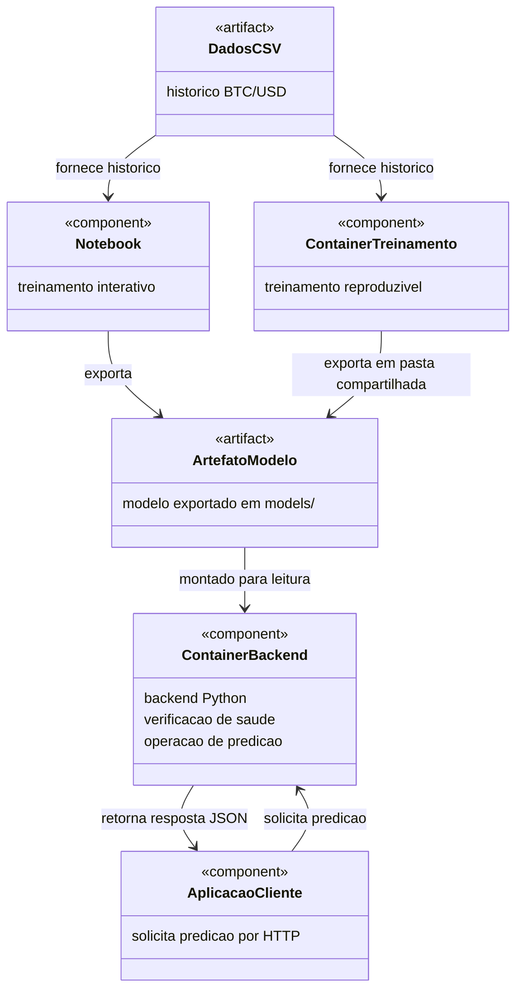

# Devlog Atividade ponderada: modelo de predição com Docker

Passo a passo de execução:
1. Importação/geração de dados
2. Treinamento do modelo no notebook
3. Conteinerizar o treinamento em docker
4. Conteinerizar um conteiner backend para carregá-lo e oferecer predições à aplicação
5. Testar a inferência da predição
6. Fechar documentação

## Documentação

- [Escopo da atividade](docs/escopo-atividade.md)
- [Devlog](docs/devlog.md)
- [Origem e validação dos dados](data/metadata.json)

## Organização do projeto

```text
.
├── README.md                 # Visão geral e comandos de execução
├── compose.yaml              # Serviços de treinamento e backend
├── docker/                   # Dockerfiles de treinamento e API
├── requirements/             # Dependências de treinamento, API e notebook
├── src/                      # Código Python de treinamento e backend
├── scripts/                  # Importação, cliente e verificação da API
├── notebooks/                # Notebook executado
├── data/                     # Dados originais, preparados e sua origem
├── models/                   # Modelo exportado, metadados e avaliação
├── examples/                 # Corpos JSON para testar a API
├── evidence/                 # Resultados JSON dos testes
│   └── httpie/               # Capturas dos testes visuais
└── docs/                     # Escopo da atividade e devlog
```

Executar os comandos a partir da raiz do projeto. O `compose.yaml` usa os Dockerfiles em `docker/` e mantém os volumes de dados e modelos nas mesmas pastas.

## Etapa 1 — Dados preparados

Bitcoin em dólar (BTC/USD), histórico diário da Bitstamp via CryptoDataDownload. O CSV preparado contém **1.372 registros de 01/01/2023 a 04/10/2026**, sendo **276 de 2026**. O dia corrente foi excluído para evitar usar um fechamento incompleto.

- Original: `data/raw/bitstamp_btcusd_daily.csv`.
- Preparado: `data/processed/btcusd_daily.csv` (`date`, `close`, `volume_btc`).
- Há uma lacuna em **22/05/2026**. O treinamento excluiu sete sequências que atravessavam esse dia, preservando o horizonte de um dia.

Para reproduzir a preparação com o CSV já salvo, no PowerShell:

```powershell
./scripts/import_data.ps1 -StartDate 2023-01-01 -AsOfDate 2026-10-05 -UseLocal
```

Para baixar novamente, execute o mesmo comando sem `-UseLocal` (requer internet e pode produzir um arquivo original atualizado). As datas dos candles são interpretadas em UTC.

## Esboço UML da arquitetura

A solução usa uma pasta de artefatos compartilhada entre os containers; o backend a recebe apenas para leitura. O notebook e o container de treinamento chamam o mesmo código de `src/train.py`; o container executa esse módulo Python diretamente.



## Etapa 2 — Treinamento no notebook

A estudante escolheu **Random Forest**. Entrada: sete fechamentos consecutivos, em ordem do mais antigo ao mais recente. Saída: fechamento do dia seguinte em USD.

O [notebook executado](notebooks/training.ipynb) usa o código de `src/train.py`. A divisão cronológica tem **1.086 amostras de treino** e **272 de teste**; sete sequências foram descartadas por atravessarem a lacuna do CSV.

| Método | MAE (USD) | RMSE (USD) |
| --- | ---: | ---: |
| Random Forest | 1.678,02 | 2.223,82 |
| Repetir último fechamento | 1.183,97 | 1.742,51 |

O Random Forest ficou pior que o baseline nesse teste. Mantemos a escolha para demonstrar a integração exigida na atividade. Após avaliar, um segundo modelo foi ajustado com todo o histórico e exportado para inferência; as métricas da tabela pertencem ao modelo treinado somente nos 80% iniciais.

Artefatos: `models/model.joblib`, `models/metadata.json` e `models/test_predictions.csv`. A recarga do modelo foi conferida no notebook. A previsão local para **05/10/2026** foi **US$ 86.913,88**, antes de existir um fechamento completo desse dia.

Para reproduzir no PowerShell, com Python 3.13 instalado:

```powershell
python -m venv .venv
./.venv/Scripts/python.exe -m pip install -r requirements/notebook.txt
./.venv/Scripts/python.exe scripts/run_notebook.py
```

Se `python` não estiver no PATH, use o caminho do executável instalado para criar o ambiente virtual. As versões das dependências de treinamento estão fixadas em `requirements/training.txt`.

## Etapa 3 — Treinamento em Docker

O container usa o mesmo código do notebook e grava o artefato na pasta `models/`, compartilhada com a máquina local. Com o Docker Desktop ativo:

```powershell
docker compose --profile training build training
docker compose --profile training run --rm training
```

**Estado:** treinamento executado pela estudante em Docker. O modelo foi salvo em `models/model.joblib`, com previsão local de **US$ 86.913,88 para 05/10/2026**. O resultado está em [evidence/training-docker.json](evidence/training-docker.json); o hash do artefato foi conferido com `models/metadata.json`.

## Etapa 4 — Backend FastAPI

O backend carrega o artefato uma vez na inicialização. A pasta `models/` é montada para somente leitura no segundo container, sem repetir o treinamento. A API recebe sete datas consecutivas e seus fechamentos, do mais antigo ao mais recente.

Para construir a imagem e iniciar o backend, aguardando a verificação de saúde:

```powershell
docker compose up --build -d --wait backend
docker compose ps
Invoke-RestMethod -Uri http://localhost:8000/health
```

O retorno esperado de `/health` inclui `status: ok` e `model_loaded: true`. A página interativa estará em `http://localhost:8000/docs`. O endpoint de predição é `POST /predict` e há uma entrada de exemplo em `examples/prediction_request.json`.

**Estado:** container ativo e **healthy**, com `/health` retornando `status: ok` e `model_loaded: true`. A evidência informada pela estudante está em [evidence/backend-health.json](evidence/backend-health.json). O conflito inicial de porta foi resolvido encerrando o Uvicorn local antes de iniciar o container.

## Etapa 5 — Testar a predição por HTTP

Com o backend ativo, execute o cliente Python:

```powershell
./.venv/Scripts/python.exe scripts/client.py
```

O cliente envia `examples/prediction_request.json` para `POST /predict`, imprime a resposta e salva a evidência em `evidence/inference.json`. O exemplo contém os fechamentos de 28/09/2026 a 04/10/2026 e deve produzir uma estimativa de **US$ 86.913,88 para 05/10/2026**.

Para conferir também a resposta do modelo e a rejeição de entradas inválidas:

```powershell
./.venv/Scripts/python.exe scripts/check_api.py
```

Esse comando registra os resultados em `evidence/api-validation.json`. A página `http://localhost:8000/docs` também permite testar manualmente.

**Estado:** predição HTTP executada com sucesso pela estudante. A resposta foi **US$ 86.913,88 para 05/10/2026**, com horizonte de um dia, conforme [evidence/inference.json](evidence/inference.json). As **oito verificações passaram**, conforme [evidence/api-validation.json](evidence/api-validation.json): saúde, predição e documentação com HTTP 200; cinco casos de entradas inválidas com HTTP 422.

### Evidências visuais no HTTPie

Com o container ativo, criar as requisições no HTTPie Desktop. Nas requisições POST, selecionar o corpo **Text → JSON**, que usa `Content-Type: application/json`, conforme a [documentação do HTTPie](https://httpie.io/docs/desktop#request-body).

| Teste | Método e URL | Corpo | Resultado esperado |
| --- | --- | --- | --- |
| Serviço ativo | `GET http://localhost:8000/health` | Sem corpo | HTTP 200, `status: ok` e `model_loaded: true` |
| Predição válida | `POST http://localhost:8000/predict` | Conteúdo de `examples/prediction_request.json` | HTTP 200, previsão de aproximadamente US$ 86.913,88 para 05/10/2026 |
| Histórico incompleto | `POST http://localhost:8000/predict` | Conteúdo de `examples/prediction_invalid_six_days.json` | HTTP 422, pois foram enviados seis dias e a API exige sete |

Os três testes manuais foram executados no HTTPie. As capturas foram salvas pela estudante em `evidence/httpie/` e incorporadas ao [devlog](docs/devlog.md):

- [Serviço ativo — HTTP 200](evidence/httpie/01-health.png).
- [Predição — HTTP 200](evidence/httpie/02-predict.png).
- [Histórico com seis dias — HTTP 422](evidence/httpie/03-invalid-history.png).

## Etapa 6 — Documentação e entrega

O desenvolvimento local e a documentação estão concluídos. O repositório inclui o diagrama UML, os dados e sua origem, o notebook executado, o código Python, os Dockerfiles, o Compose, o modelo exportado e as evidências JSON e visuais. A entrega no GitHub ainda depende do commit e do push dos arquivos.

Pré-requisitos para reproduzir: Docker Desktop ativo; Git para obter o repositório; Python 3.13 para executar o notebook ou os clientes Python. Os comandos deste README são para PowerShell, executados na raiz do projeto. Os dados já estão salvos, portanto não é necessário baixá-los novamente.

Para demonstrar a solução usando o modelo exportado, construir/iniciar o backend na etapa 4 e executar o cliente da etapa 5. Para gerar o modelo novamente, executar antes o treinamento da etapa 3. Se treinar novamente com o backend já ativo, reiniciá-lo para carregar o novo artefato:

```powershell
docker compose restart backend
```

Para a apresentação, mostrar o UML, explicar o compartilhamento de `models/`, consultar `/health`, solicitar uma predição e apresentar as métricas e limitações. As três capturas do HTTPie registram as respostas válidas e a rejeição de uma entrada incompleta.

Para encerrar os serviços depois da demonstração:

```powershell
docker compose down
```

Os dados e o modelo permanecem nas pastas locais compartilhadas. O repositório de entrega configurado é [arielly-lima/EC-S10-Atividade-Docker](https://github.com/arielly-lima/EC-S10-Atividade-Docker).

## Limitações

Predição experimental, usando somente sete fechamentos. Não considera notícias ou fatores externos, e o modelo não extrapola bem para preços fora da faixa observada. A atividade demonstra integração; as predições não são recomendações de investimento.
