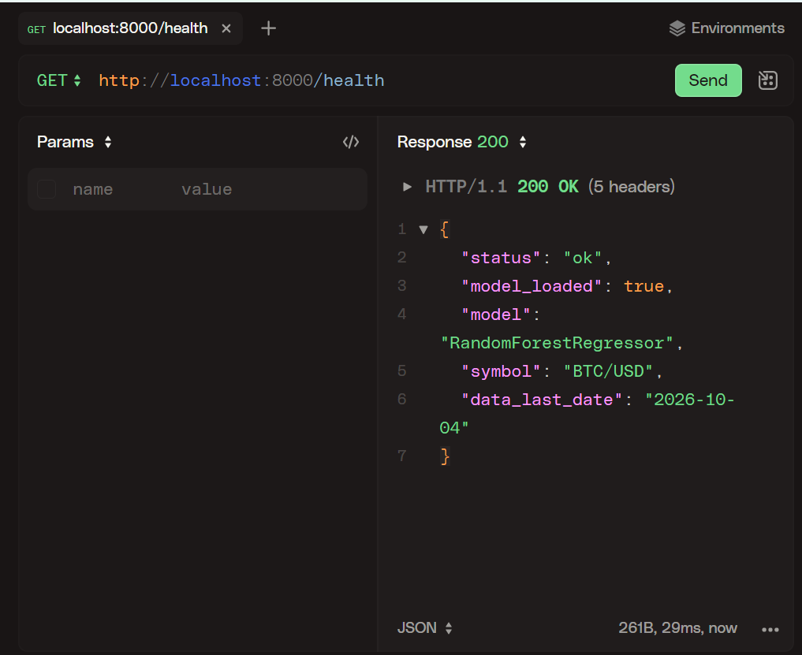
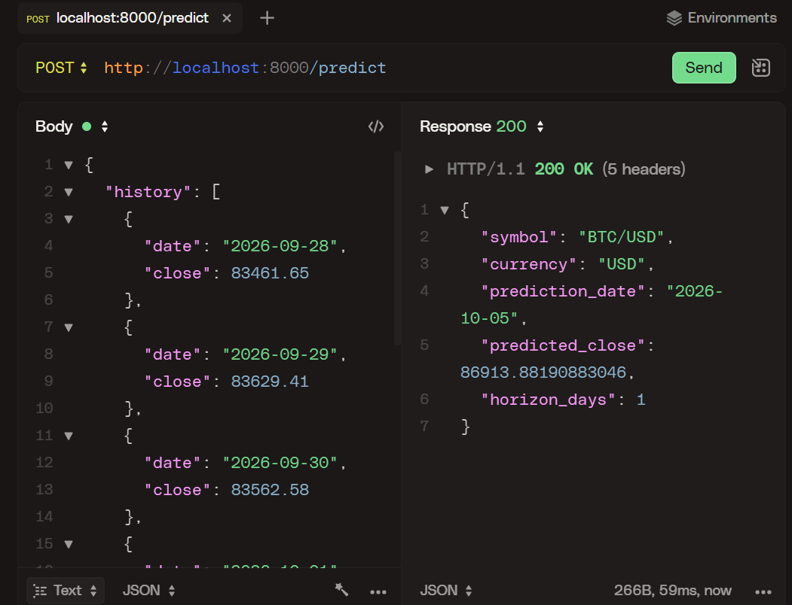
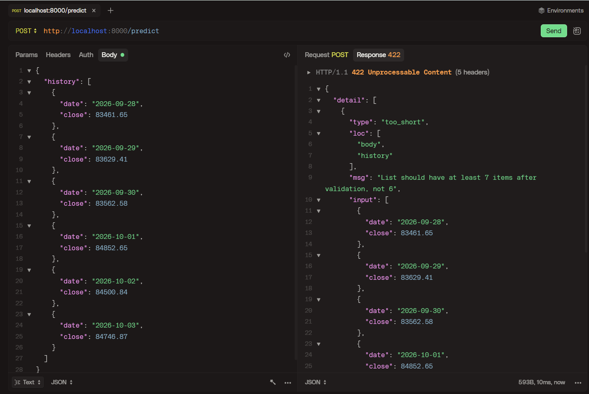
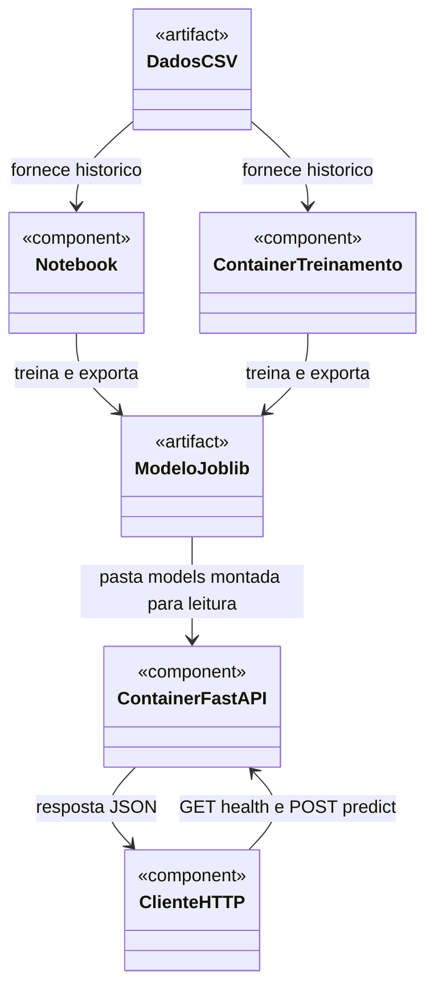

# Devlog Atividade ponderada: modelo de predição com Docker

Passo a passo de execução:
1. Importação/geração de dados
2. Treinamento do modelo no notebook
3. Conteinerizar o treinamento em docker
4. Conteinerizar um conteiner backend para carregá-lo e oferecer predições à aplicação
5. Testar a inferência da predição
6. Fechar documentação

# 1. Documentação de cada etapa:

## 1.1. Importação/geração de dados

Antes de iniciar o desenvolvimento com auxilio de IA, dividi a atividade nas etapas acima, visando documentar cada etapa.

Para a base de dados, selecionei a [CryptoDataDownload, histórico da Bitstamp](https://www.cryptodatadownload.com/data/bitstamp/), para o par BTC/USD. 
A escolha está relacionada ao fato que essa base de dados está entre as opções indicadas no escopo. Além disso, a página informa que fornece dados históricos em CSV com abertura, máxima, mínima, fechamento e volume. 

## 05/10/2026 — Etapa 1: importação dos dados

- Mantive o Bitcoin (BTC/USD) e ampliei o período para incluir dados recentes de 2026.
- Importei o CSV da Bitstamp e preparei **1.372 registros de 01/01/2023 a 04/10/2026**, incluindo **276 registros de 2026**. Excluí o dia corrente, que poderia conter fechamento incompleto.
- Preservei o CSV original e gerei um CSV com data, fechamento e volume, em ordem cronológica. As datas dos candles são interpretadas em UTC.
- A validação identificou a ausência de **22/05/2026**. Mantive a lacuna; o treinamento deverá descartar sequências que atravessem esse dia, sem preencher preços artificiais.
- Registrei a origem, a contagem e os hashes dos arquivos em `data/metadata.json`. O comando de reprodução e o esboço UML estão no README.
- Corrigi o diagnóstico inicial do ambiente: o Python **3.13.14** está instalado, embora o inicializador `py` não o encontre. O servidor Docker ainda precisa ficar disponível antes da etapa dos containers.
- Próxima decisão: escolher entre regressão Ridge e Random Forest para prever o fechamento do dia seguinte usando os últimos sete dias. O treinamento ainda não foi executado.

## 05/10/2026 — Etapa 2: treinamento no notebook

- Escolhi **Random Forest** para capturar relações mais complexas entre os sete fechamentos anteriores e o fechamento do dia seguinte.
- Executei `./.venv/Scripts/python.exe scripts/run_notebook.py`. A divisão cronológica ficou em **1.086 amostras de treino** e **272 de teste**, com sete sequências descartadas pela lacuna nos dados.
- O Random Forest teve **MAE de US$ 1.678,02** e **RMSE de US$ 2.223,82**. O baseline de repetir o último fechamento teve **MAE de US$ 1.183,97** e **RMSE de US$ 1.742,51**. O modelo ficou pior nessa avaliação; registrei essa limitação sem alterar a escolha para favorecer o resultado do teste.
- Após avaliar, ajustei um segundo modelo com todo o histórico para a inferência e o exportei como `models/model.joblib`. As métricas correspondem apenas à avaliação anterior, sem usar o teste no ajuste daquele modelo.
- Recarreguei o artefato no notebook e conferi a previsão local para **05/10/2026: US$ 86.913,88**. Essa demonstração ainda não usa o backend.
- Fixei as versões das bibliotecas para repetir o ambiente no Docker. O notebook foi executado novamente após ajustar seu executor para usar diretórios temporários de configuração, evitando a restrição de escrita no histórico global do IPython.
- Próxima etapa: executar o treinamento em Docker e escolher a biblioteca do backend Python.

## 05/10/2026 — Preparação dos containers

- Escolhi **FastAPI** para o backend, com uma página interativa de testes em `/docs`.
- Construí a imagem de treinamento com `docker compose --profile training build training`. A execução do treinamento dentro do container ainda está pendente.
- Preparei o backend Python, seu Dockerfile e os comandos de teste. A pasta `models/` levará o artefato ao backend por um volume de somente leitura.
- A partir desta etapa, executarei os comandos com acompanhamento da IA para aprender o processo. A execução em containers e os testes HTTP serão registrados após observar seus resultados.

## 05/10/2026 — Etapa 3: treinamento executado em Docker

- Executei `docker compose --profile training run --rm training` e o container treinou e exportou o modelo para a pasta compartilhada `models/`.
- A execução confirmou **1.358 amostras utilizáveis**, sendo **1.086 de treino e 272 de teste**, e previsão local de **US$ 86.913,88 para 05/10/2026**. As métricas coincidiram com as do notebook, salvo diferenças numéricas desprezíveis.
- A saída informada no terminal foi preservada a partir do JSON correspondente em `evidence/training-docker.json`. O hash do arquivo `model.joblib` corresponde ao registrado nos metadados.
- Próximo passo: iniciar o backend FastAPI no segundo container e conferir `/health`, antes de testar a predição por HTTP.

## 05/10/2026 — Etapa 4: conflito de porta na inicialização

- Executei a construção do backend; a imagem `ec-s10-atividade-docker-backend` foi criada.
- O container não iniciou porque a porta **8000** estava ocupada pelo servidor Uvicorn local que a IA havia iniciado na preparação e que continuou ativo após a interrupção.
- Identificamos o processo pelo comando completo deste projeto. O `/health` retornou `ok`, mas essa resposta veio do servidor local e ainda não comprova a execução no container.
- Correção orientada: encerrar o servidor local, iniciar o backend em Docker e conferir `docker compose ps` antes de repetir `/health`. A confirmação da execução em container segue pendente.

## 05/10/2026 — Etapa 4: backend ativo em Docker

- Encerrei o servidor local identificado e executei `docker compose up -d --wait backend`.
- O `docker compose ps` confirmou o container `ec-s10-atividade-docker-backend-1` ativo e **healthy**, expondo a porta 8000.
- Consultei `/health`: retornou `status: ok`, `model_loaded: true`, modelo `RandomForestRegressor` e histórico até `2026-10-04`. A evidência informada no terminal está em `evidence/backend-health.json`.
- Etapa 4 concluída. Próxima etapa: enviar os sete fechamentos de exemplo para `/predict` e conferir a resposta do backend.

## 05/10/2026 — Etapa 5: predição por HTTP

- Executei `./.venv/Scripts/python.exe scripts/client.py`. O cliente enviou os sete fechamentos de 28/09/2026 a 04/10/2026 ao backend em Docker.
- O backend respondeu com `BTC/USD`, moeda `USD`, horizonte de **um dia** e previsão de **US$ 86.913,88 para 05/10/2026**, coincidente com a inferência local do artefato.
- A solicitação, a verificação de saúde e a resposta foram salvas em `evidence/inference.json`. A integração entre treinamento, artefato, backend e cliente foi demonstrada.
- Antes de fechar a documentação, falta executar `scripts/check_api.py` para verificar também a rejeição de entradas inválidas.

## 05/10/2026 — Etapa 5: verificações da API

- Executei `./.venv/Scripts/python.exe scripts/check_api.py` e as **oito verificações passaram**. A evidência está em `evidence/api-validation.json`.
- Saúde, predição e documentação retornaram HTTP **200**. Histórico com seis dias, datas não consecutivas, preço negativo, preço não finito e datas em ordem inversa foram rejeitados com HTTP **422**, conforme esperado.
- Escolhi complementar os registros com testes visuais no **HTTPie Desktop**, antes de concluir a documentação. Foram preparados os exemplos e a pasta `evidence/httpie/` para capturar saúde, predição e rejeição de histórico incompleto. Os testes manuais e as capturas ainda estão pendentes.

## 05/10/2026 — Etapa 5: evidências visuais no HTTPie

Executei os três testes no HTTPie e salvei as capturas em `evidence/httpie/`.

**Serviço ativo:** `GET /health` retornou HTTP **200**, `status: ok` e `model_loaded: true`.

**Predição válida:** `POST /predict` retornou HTTP **200** e estimou o fechamento de **05/10/2026 em US$ 86.913,88**, usando sete fechamentos anteriores.

**Histórico incompleto:** `POST /predict` com seis dias retornou HTTP **422**, informando que a lista deve conter ao menos sete registros. Essa rejeição é o resultado esperado do teste.

## 05/10/2026 — Etapa 6: fechamento da documentação

- Concluí as etapas locais: dados históricos, treinamento no notebook, treinamento em Docker, backend Python em um segundo container e predição por HTTP.
- Registrei as decisões, métricas, a lacuna do CSV, o conflito de porta e sua resolução, os oito testes aprovados e as três capturas do HTTPie.
- A principal limitação observada foi o Random Forest ter erro maior que repetir o último fechamento. Mantive essa comparação documentada; a previsão é experimental.
- O README contém os comandos para reproduzir e demonstrar a solução. O modelo exportado acompanha o repositório; também pode ser gerado novamente pelo treinamento.
- A publicação dos arquivos no GitHub segue pendente de commit e push.

### UML e fluxo do artefato

O notebook e o container de treinamento usam `src/train.py`. O treino grava `models/model.joblib`; o backend recebe a mesma pasta como volume de somente leitura e carrega o artefato ao iniciar. O cliente Python e o HTTPie solicitam predições por HTTP.

## 05/10/2026 — Preparação para versionamento

- Atualizei o `.gitignore` para excluir ambientes virtuais, caches, variáveis locais, arquivos temporários e configurações pessoais de editores.
- Mantive os dados, o notebook executado, o modelo exportado e as evidências JSON e visuais na entrega. Logs dentro de `evidence/` também podem ser versionados.

## 05/10/2026 — Organização das pastas

- Reuni o escopo e o devlog em `docs/`, os Dockerfiles em `docker/` e as dependências em `requirements/`.
- Reuni as capturas do HTTPie em `evidence/httpie/`, junto das demais evidências de execução.
- Atualizei os caminhos do Compose, a instalação das dependências e os links da documentação. O README apresenta a árvore de pastas e os comandos atualizados, executados a partir da raiz.
- Conferi a configuração do Compose, os arquivos usados pelos Dockerfiles, as dependências instaladas e os links das imagens. Os arquivos de capturas, escopo e modelo mantiveram seus conteúdos.
